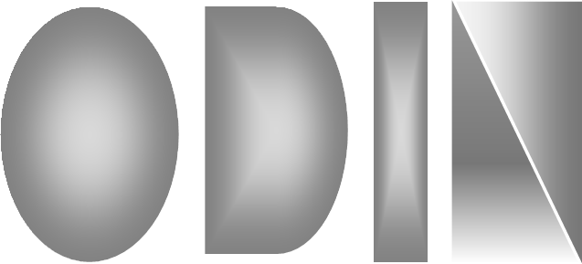

# odin-slides



**odin-slides** is an advanced Python tool that empowers you to effortlessly draft impressive PowerPoint presentations. Leveraging the capabilities of Large Language Models (LLM), odin-slides enables content summarization, slide generation, and seamless presentation creation or updating based on user input and a chosen template. Whether you're preparing a business pitch, a conference presentation, or a classroom lecture, odin-slides simplifies the process and saves you valuable time.

[](https://odin-slides.readthedocs.io/en/latest/?badge=latest)
[](https://github.com/leonid20000/odin-slides/actions/workflows/codeql.yml)


## Demo Video

Experience the power of odin-slides in action with an engaging demo. Click the play button below to witness how this useful Python tool, driven by LLMs, effortlessly streamlines presentation creation and saves you valuable time:

[](https://www.youtube.com/watch?v=-rr7rar6td8)

## Table of Contents

- [Features](#features)
- [Installation](#installation)
  - [Installing via Distribution Package](#installing-via-distribution-package)
  - [Installing from the Git Repository](#installing-from-the-git-repository)
  - [Development Installation](#development-installation)
- [Usage](#usage)
- [Examples](#examples)
- [Supported File Types](#supported-file-types)
- [Contributions](#contributions)
- [License](#license)
- [Acknowledgments and Credits](#acknowledgments-and-credits)
- [Contact](#contact)

## Features

- **Smart Presentation Creation:** Easily create new PowerPoint presentations or update existing ones with odin-slides' user-friendly command-line interface. Simply provide a template and let odin-slides handle the rest.

- **Input-Driven Presentation Generation:** Leverage the power of odin-slides to effortlessly transform Microsoft Word (docx) files into captivating presentations. This intelligent tool expertly distills extensive Word documents, converting input into impactful and concise slides. (Keep an eye out for forthcoming updates that will enhance compatibility, adding support for file formats like LaTeX and PDF.)

- **Customizable Language Models:** odin-slides supports different language models, with OpenAI GPT-3.5 Turbo as the initial model. You have the flexibility to choose the language model that best fits your presentation needs.

- **Automatic Template Loading:** Specify your desired PowerPoint file as a template, and odin-slides will automatically load its layout theme. No need to manually configure the template every time you create a new presentation.

- **Session Resumption:** Save your presentation creation sessions and resume them later, so you can work at your own pace. odin-slides keeps track of your progress and allows you to pick up right where you left off.

- **Extensibility:** odin-slides is designed to support additional Language Models and file types in future updates. Stay tuned for enhanced functionality and new features.

## Installation

### Installing via Distribution Package

To install odin-slides from a distribution package, utilize the provided pip command:

```bash
pip install odin-slides
```

This command will retrieve and install the odin-slides package from the Python Package Index (PyPI).

### Installing from the Git Repository

To use the latest version of odin-slides directly from the Git repository, follow these simple steps:

1. Install odin-slides as a command-line tool using pip:

```bash
pip install git+https://github.com/leonid20000/odin-slides.git
```

### Development Installation

To install odin-slides in development mode (editable mode) and contribute to its development, follow these steps:

1. Clone the odin-slides repository to your local machine.

```bash
git clone https://github.com/leonid20000/odin-slides.git
```

2. Change into the following directory.

```bash
cd odin_slides
```

3. Install the required dependencies.

```bash
pip install -r requirements.txt
```

4. Install odin-slides in development mode.

```bash
pip install -e .
```

Now you can make changes to the odin-slides codebase, and the changes will be immediately reflected when you run the odin-slides command-line tool.


## Usage

Before running `odin-slides`, you need to ensure that you have set your OpenAI API key as an environment variable named `ODIN_SLIDES_LLM_API_KEY`. This API key is required for the application to communicate with the OpenAI services. 

> **Notice:** Make sure that you put usage limits on the keys that you create and regularly rotate your keys. This helps ensure the security of your API access and prevents misuse.


Once you have set the API key, you can execute the following command in your terminal:

```bash
odin-slides -t <template_file> -o <output_file> [-i <input_file_path>] [-s <session_file_path>]
```

`<template_file>`: Path to an existing PowerPoint file to copy the layout theme from.

`<output_file>`: Desired output file name for the presentation (without the extension).

`<input_file_path>` (optional): Path to an input Word document to create the presentation based on. Large Word documents will be automatically summarized for presentation purposes.

`<session_file_path>` (optional): Path to a previously saved session file to resume.

Note: For input files larger than 5000 words, odin-slides automatically summarizes them for presentation purposes. You can also resume sessions to continue your presentation creation journey.

## Examples

- Create a new presentation from scratch:

```bash
odin-slides -t /path/to/template.pptx -o my_presentation
```

- Resume a session and continue working on a presentation:

```bash
odin-slides -t /path/to/template.pptx -o my_presentation -s /path/to/my_presentation_session.pkl
```

- Generate a presentation from an existing Word document:

```bash
odin-slides -t /path/to/template.pptx -o my_presentation -i /path/to/input.docx
```


## Supported File Types

odin-slides currently supports the following file types for input documents:

- Microsoft Word (docx): Easily generate presentations from your existing Word documents. Even large Word documents are automatically summarized for concise and effective presentation creation. (Note: Other file types such as LaTeX and PDF will be supported in future updates.)

## Contributions

Contributions to odin-slides are welcome! If you find any issues, have suggestions for improvements, or would like to contribute in any way, please feel free to open an issue or submit a pull request.


## Acknowledgments and Credits

This project was created by Dr. Leonit Zeynalvand and offered under the MIT License.


## Light Up the Night

**odin-slides** is an open-source project, embracing the power of community. Consider giving it a star 🌟, if you think it deserves one. Your star helps acknowledge the collective effort behind this project and motivates further improvements.

Thank you for being a part of our open source community! 🌟
